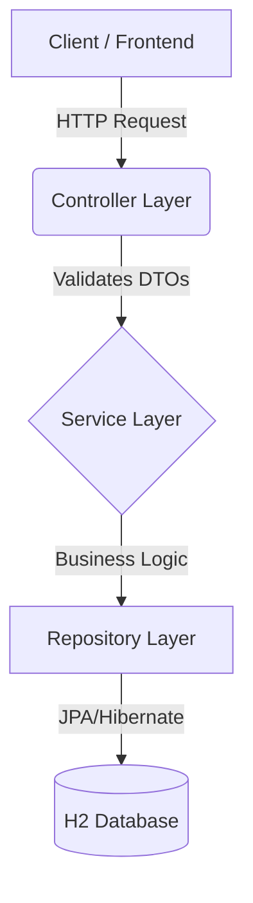

# Personal Finance Manager API

[](https://www.oracle.com/java/)
[](https://spring.io/projects/spring-boot)
[](https://maven.apache.org/)
[](LICENSE)
[](target/site/jacoco/index.html)

A RESTful backend application for managing personal finances, built with Java 17 and Spring Boot 3.2.0. This API allows users to track their income, expenses, and savings goals with comprehensive reporting features.

## Tech Stack

| Technology | Version | Purpose |
|------------|---------|---------|
| Java | 17 | Runtime |
| Spring Boot | 3.2.0 | Framework |
| Spring Security | 6.x | Session-based Auth |
| H2 Database | In-memory | Data Persistence |
| Maven | 3.9+ | Build Tool |
| JUnit 5 + Mockito | - | Testing |
| JaCoCo | 0.8.11 | Code Coverage |

## Architecture

This project follows a standard Layered Architecture to ensure separation of concerns, maintainability, and scalability.



### Key Components
- **Controller Layer** (`com.syfe.finance.controller`): Handles incoming HTTP requests, performs input validation using `@Valid`, and maps internal entities to DTOs for the response.
- **Service Layer** (`com.syfe.finance.service`): Contains the core business logic (e.g., calculating savings goal progress, preventing deletion of active categories).
- **Repository Layer** (`com.syfe.finance.repository`): Interfaces with the database using Spring Data JPA.

### Design Decisions
- **Session-Based Authentication**: Chosen over JWT to strictly adhere to the assignment requirement for secure, server-side session management (`JSESSIONID`).
- **DTO Pattern**: Separation of 'Entity' (Database) and 'DTO' (API) classes prevents exposing internal database structures (like password hashes) to the client.
- **Data Isolation**: All service methods explicitly filter data by the authenticated `userId` to ensure users can never access each other's financial data.

## Features

- **User Authentication**: Session-based login/logout with BCrypt password hashing
- **Transaction Management**: CRUD operations for income/expense tracking
- **Category Management**: Default + custom categories per user
- **Savings Goals**: Goal tracking with automatic progress calculation
- **Financial Reports**: Monthly and yearly aggregated reports by category

## Setup Instructions

### Prerequisites
- JDK 17+
- Maven 3.9+

### Run with Maven

```bash
# Clone the repository
git clone https://github.com/ashish-goyal-1/personal-finance-manager.git
cd personal-finance-manager

# Build the project
mvn clean package -DskipTests

# Run the application
mvn spring-boot:run
```

The server starts at `http://localhost:8080`

### Run with Docker

```bash
# Build the jar first
mvn clean package -DskipTests

# Build Docker image
docker build -t personal-finance-manager .

# Run container
docker run -p 8080:8080 personal-finance-manager
```

## API Documentation

### 1. Authentication

**Register User**
`POST /api/auth/register`
```json
{
  "username": "user@example.com",
  "password": "password123",
  "fullName": "John Doe",
  "phoneNumber": "+1234567890"
}
```

**Login**
`POST /api/auth/login`
```json
{
  "username": "user@example.com",
  "password": "password123"
}
```

**Logout**
`POST /api/auth/logout`

### 2. Transactions

**Create Transaction**
`POST /api/transactions`
```json
{
  "amount": 150.50,
  "date": "2026-01-01",
  "category": "Food",
  "description": "Grocery shopping",
  "type": "EXPENSE"
}
```

**Get All Transactions**
`GET /api/transactions`
*Optional Params:* `?startDate=2026-01-01&endDate=2026-01-31`

### 3. Categories

**Create Custom Category**
`POST /api/categories`
```json
{
  "name": "Crypto Investments",
  "type": "INCOME"
}
```

**Get All Categories**
`GET /api/categories`

### 4. Savings Goals

**Create Goal**
`POST /api/goals`
```json
{
  "goalName": "New Laptop",
  "targetAmount": 2000.00,
  "targetDate": "2026-06-01",
  "startDate": "2026-01-01"
}
```

### 5. Reports

**Get Monthly Report**
`GET /api/reports/monthly/2026/1`

**Get Yearly Report**
`GET /api/reports/yearly/2026`

## Test Coverage

**Total Coverage: 81%** ✅ (Exceeds 80% requirement)

| Package | Coverage |
|---------|----------|
| controller | 100% |
| service | 95% |
| dto | 83% |
| entity | 81% |
| exception | 75% |
| **TOTAL** | **81%** |

### Run Tests

```bash
mvn test jacoco:report
```

## Project Structure

```
src/main/java/com/syfe/finance/
├── config/          # SecurityConfig, DataSeeder
├── controller/      # REST Controllers (5)
├── dto/             # Request/Response DTOs (17)
├── entity/          # JPA Entities (5)
├── exception/       # Custom Exceptions + GlobalHandler
├── repository/      # Spring Data Repositories (4)
└── service/         # Business Logic Services (6)
```

## Security

- Session-based authentication (JSESSIONID cookie)
- BCrypt password encoding
- CSRF disabled (REST API)
- Public endpoints: `/api/auth/register`, `/api/auth/login`
- Protected endpoints require authentication

## Default Categories

Seeded on application startup:
- **INCOME**: Salary
- **EXPENSE**: Food, Rent, Transportation, Entertainment, Healthcare, Utilities

## Deployment

Configured for Render deployment:
- Uses `PORT` environment variable
- Dockerfile included for containerized deployment

## License

This project was created as part of the Syfe Backend Intern assignment.
